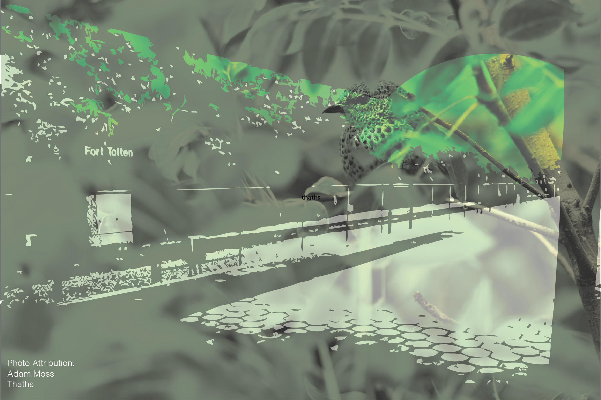

<h5>Something to Share Or You Snooze You Don't Lose?</h5>

	I had a dream that my brother and I were on a metro or a bus going through Brazil, through Amazonia, and we were carrying big bags and buckets of ice with us. At one point we were in the thick of deep tropical forest, mossy and overgrown, and I remember feeling satisfied with our decision to take the scenic path to our destination. I recall that our bus was not disturbing the area, just moving past it, like clouds. Other times we would get off at a stop that looked like Fort Totten, a cement ledge on a hilltop over a savanna. Often we would forget to pick up many of the bags at the rest stop but I would notice and run out to get them. Then I'd yell to Max and tell him he needed to get the other items while I held the doors open against the will of the driver.

 

We were rather concerned with directions, often arguing about whether we were headed in the right direction or talking about two different routes we could take with different color coded transfer points. At some points the scenery looked like the LA river, giant flood zones with heavy grates spewed water while nearby bikers passed, ignoring the smell. I don't remember why we were so frantic or where we were heading, just that we were in a fervour to get there. In some ways the lasting memory of my dream is similar to humans experience with the passage of time. It reflects our fixation with productivity, finality and results, which reminds me of that old saying, "it's not so much where you end up but how you get there". If I can't remember where I end up, I only get a chance to care about the process. The emphasis of the dream fell on the adventure not the accomplishment. In this way, my poor memory is helping remind me to enjoy the learning process, allowing me to veer wholeheartedly along with my mistakes and clumsiness.  There is some futility, if I entertain possible missions for my brother and I, in travelling through Brazil with ice. Here lies the physical manifestation of ephemerality within my dream. If I take too long, the precious cargo will be memorialised by heavy, precarious bags of water, or if I am clumsy, soaking wet clothes. 
